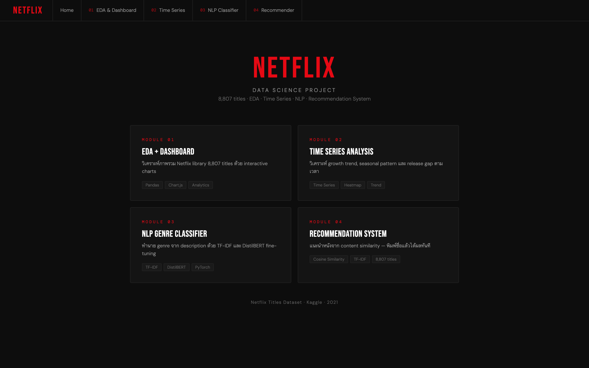
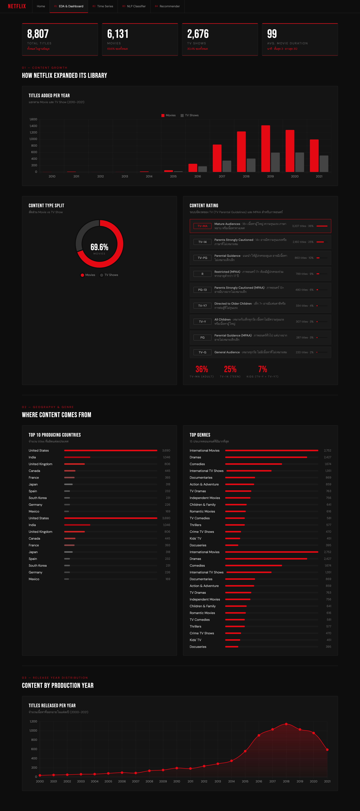
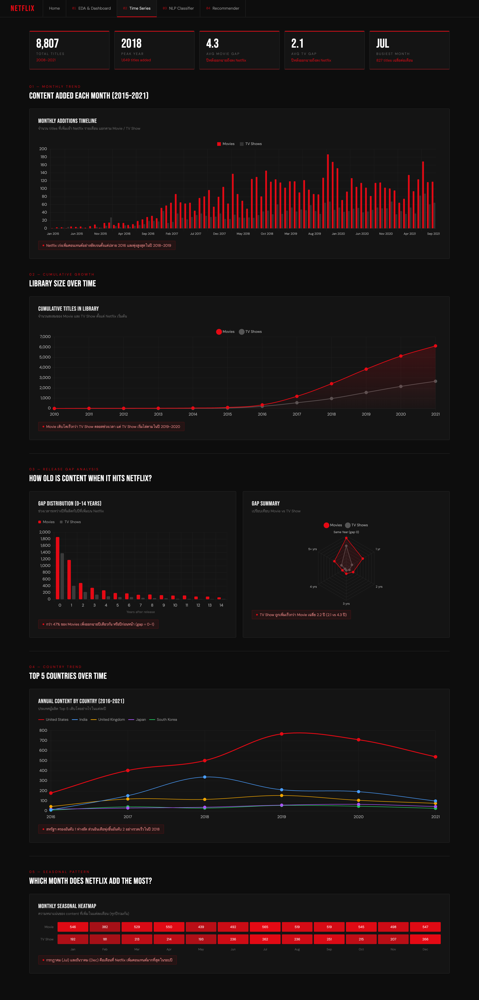
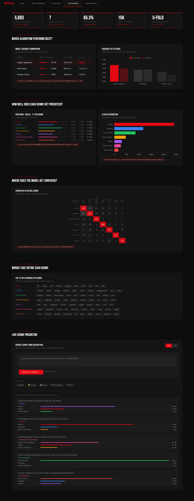
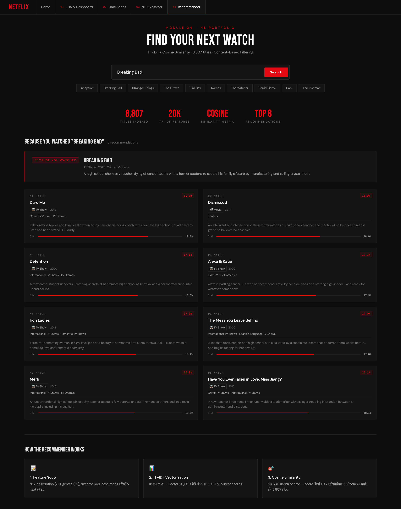

# Netflix Data Science Portfolio

> **End-to-end Data Science project** จากข้อมูลดิบ → EDA → Time Series → NLP → Recommendation System
> ใช้ข้อมูลจาก Netflix Titles Dataset (8,807 titles)


---

## Demo

Interactive dashboard รวมทั้ง 4 module ในไฟล์ `index.html` — เปิดในเบราว์เซอร์ได้เลย (สลับหน้าผ่านแท็บด้านบน)



| Module 01 — EDA & Dashboard | Module 02 — Time Series |
|:---:|:---:|
|  |  |
| ภาพรวม library, content type split, rating, top countries/genres | Growth trend, cumulative library, release gap, seasonal heatmap |
| **Module 03 — NLP Genre Classifier** | **Module 04 — Recommender** |
|  |  |
| Model comparison, confusion matrix, keyword ต่อ genre, live predictor | ค้นชื่อเรื่อง → Top-8 ที่คล้ายที่สุดด้วย cosine similarity |

> **การเปิดดู:** clone repo แล้วเปิด `index.html` ด้วยเบราว์เซอร์ หรือรัน `python3 -m http.server` ในโฟลเดอร์แล้วเข้า `http://localhost:8000`

---

## Project Structure

```
Netflix-Content-Analysis/
├── index.html                       # Interactive dashboard — ทั้ง 4 module รวมในไฟล์เดียว (nav tabs)
├── netflix_titles.csv               # Raw dataset (8,807 titles)
├── netflix_bert_classifier.ipynb    # DistilBERT fine-tuning (Google Colab)
├── LICENSE
└── README.md
```

> **หมายเหตุ:** ทั้ง 4 module (EDA · Time Series · NLP · Recommender) รวมอยู่ใน `index.html` เดียว สลับดูได้ผ่านแท็บด้านบน เปิดไฟล์นี้ในเบราว์เซอร์เพื่อดู dashboard

---

## Modules

### Module 01 — EDA + Dashboard
**เครื่องมือ:** Python · Pandas · Chart.js

วิเคราะห์ภาพรวมของ Netflix library ทั้งหมด

**Key Findings:**
- Movie ครอง 69.6% ของ content ทั้งหมด TV Show 30.4%
- Netflix เร่งเพิ่ม content อย่างชัดเจนในปี 2016 และพีคที่ปี 2018–2019
- สหรัฐฯ ผลิต content มากที่สุด (3,690 titles) อินเดียตามมาอันดับ 2 (1,046)
- TV-MA ครองอันดับ 1 ที่ 36% สะท้อนว่า Netflix เน้น adult content

---

### Module 02 — Time Series Analysis
**เครื่องมือ:** Python · Pandas · Chart.js

วิเคราะห์ pattern การเพิ่ม content ตามเวลา

**Key Findings:**
- Netflix เพิ่ม content เฉลี่ย **1,649 titles/ปี** ในช่วง peak (2018)
- Movie ถูกเพิ่มบน Netflix ช้ากว่า release เฉลี่ย **4.3 ปี** vs TV Show **2.1 ปี**
- กรกฎาคม และ ธันวาคม คือเดือนที่ Netflix เพิ่ม content มากที่สุด (seasonal pattern)
- อินเดียพุ่งขึ้นเป็นอันดับ 2 อย่างรวดเร็วในปี 2018 สะท้อน global expansion strategy

---

### Module 03 — NLP Genre Classifier
**เครื่องมือ:** Python · scikit-learn · TF-IDF · HuggingFace Transformers · PyTorch

Train โมเดลทำนาย genre จาก description ของเรื่อง เปรียบเทียบ 2 approach

#### Baseline: TF-IDF + Logistic Regression

| Model | Test Accuracy | CV Score |
|---|---|---|
| Logistic Regression | **65.3%** | 62.2% ±1.5 |
| Naive Bayes | 60.9% | 61.1% ±1.5 |
| Random Forest | 59.1% | 56.3% ±1.0 |

#### Upgrade: DistilBERT Fine-tuning (Google Colab T4 GPU)

| | TF-IDF Baseline | DistilBERT |
|---|---|---|
| Accuracy | 64.5% | **69.0%** |
| Improvement | — | **+4.5%** |
| Training time | < 1 min | ~20 min (GPU) |
| Parameters | — | 66M |

**Training config:** 4 epochs · AdamW lr=2e-5 · Linear warmup 10% · Max length 128 tokens

**Key Insights:**
- Documentaries ทำนายได้แม่นที่สุด (F1 83%) เพราะมีคำเฉพาะทางชัดเจน
- Dramas ↔ Comedies สับสนกันมากที่สุด เพราะ description มักใช้ภาษาคล้ายกัน
- Class weighting ช่วย minority class (Horror, Thrillers) แต่ลด overall accuracy จาก 69% → 60.8% — แสดงให้เห็น **accuracy-fairness tradeoff** ที่พบบ่อยใน real-world ML

---

### Module 04 — Content-Based Recommendation System
**เครื่องมือ:** Python · scikit-learn · TF-IDF · Cosine Similarity

ระบบแนะนำหนังจาก content similarity โดยไม่ต้องใช้ข้อมูล user behavior

**Architecture:**

```
Input title
    ↓
Feature Soup (description ×3, genres ×2, director ×2, cast, rating)
    ↓
TF-IDF Vectorization (20,000 features, unigram + bigram)
    ↓
Cosine Similarity Matrix (8,807 × 8,807)
    ↓
Top-8 Most Similar Titles
```

**Feature weights:**
| Feature | Weight | เหตุผล |
|---|---|---|
| Description | ×3 | เนื้อหาหลักของเรื่อง |
| Genres | ×2 | categorical signal ชัดเจน |
| Director | ×2 | style ของผู้กำกับคล้ายกัน |
| Cast | ×1 | supporting signal |
| Rating | ×1 | audience target group |

**Limitation:** TF-IDF วัดจาก text similarity ไม่ใช่ semantic meaning เช่น Breaking Bad อาจไม่แนะนำ Narcos แม้ concept คล้ายกัน เพราะ description ใช้คำต่างกัน — production จริงควรใช้ collaborative filtering หรือ hybrid approach

---

## Tech Stack

| Category | Tools |
|---|---|
| Language | Python 3.11 |
| Data | Pandas, NumPy |
| Visualization | Chart.js, Matplotlib, Seaborn |
| ML | scikit-learn, PyTorch, HuggingFace Transformers |
| NLP | TF-IDF, DistilBERT (distilbert-base-uncased) |
| Environment | Local · Google Colab (GPU) |

---

## Results Summary

| Module | Technique | Key Metric |
|---|---|---|
| EDA | Descriptive Analytics | 8,807 titles analysed |
| Time Series | Trend + Seasonality Analysis | Peak: 2018 (1,649 titles/yr) |
| NLP Classifier | TF-IDF → DistilBERT | 64.5% → **69.0%** accuracy |
| Recommender | TF-IDF + Cosine Similarity | 8,807 titles indexed |

---

## What I Learned

**Data:** Dataset ที่ imbalanced (Drama 15× มากกว่า Horror) ส่งผลต่อ model อย่างมาก และ class weighting ไม่ได้แก้ปัญหาเสมอไป

**NLP:** BERT เข้าใจ context ได้ดีกว่า TF-IDF แต่ต้องการข้อมูลพอเพียงและ GPU ในขณะที่ TF-IDF ยังเป็นตัวเลือกที่ดีสำหรับ resource-constrained environment

**Recommendation:** Content-based filtering ง่ายและ interpretable แต่มีข้อจำกัดเรื่อง semantic understanding — hybrid approach กับ collaborative filtering จะให้ผลดีกว่าใน production

---

## Future Improvements

- [ ] เพิ่มข้อมูล user ratings เพื่อทำ Collaborative Filtering
- [ ] ใช้ multilingual model (mBERT/XLM-R) รองรับภาษาไทย
- [ ] Deploy Recommender เป็น FastAPI endpoint
- [ ] เพิ่ม Time Series forecasting ด้วย Prophet

---

## Dataset

[Netflix Movies and TV Shows](https://www.kaggle.com/datasets/shivamb/netflix-shows) — Kaggle (shivamb)

8,807 titles · 12 columns · อัปเดตถึงปี 2021
